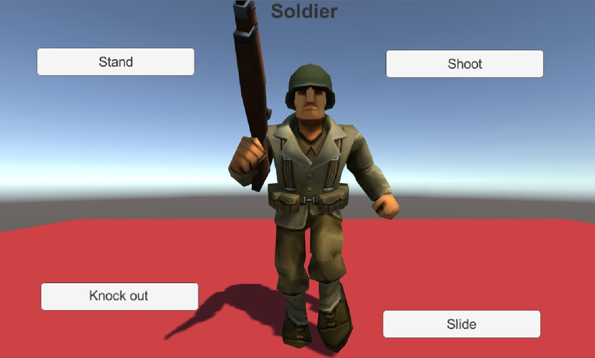

# Interactive Soldier

This is a very basic unity project where I downloaded a character (Soldier) from unity3d.com and added animations to it from other characters. The soldier stays idle, shoots, slides or gets knocked down depending on what the user wants. 
